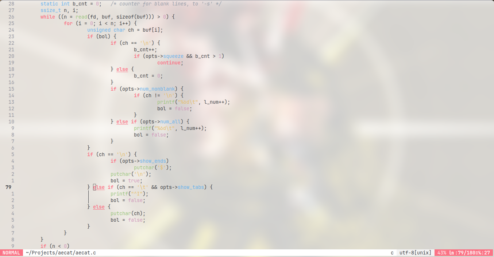
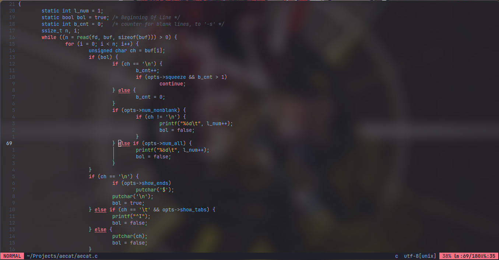

# ppurpp

My personal colorscheme for vim/neovim and more.

<details open>
<summary>screenshots</summary>




</details>

## Install

<details open>
<summary>vim.pack</summary>

```lua
vim.pack.add({ "https://github.com/kurumihere/ppurpp" })
require("ppurpp").setup()
vim.cmd.colorscheme("ppurpp")
```

</details>

<details>
<summary>lazy.nvim</summary>

```lua
{ "kurumihere/ppurpp", priority = 1000, config = true, opts = {} }
```

</details>

<details>
<summary>packer</summary>

```lua
use { "kurumihere/ppurpp" }
```

</details>

<details>
<summary>vim-plug</summary>

```vim
Plug 'kurumihere/ppurpp'
```

</details>

<details>
<summary>emacs</summary>

Copy `ports/emacs/ppurpp-theme.el` to a local directory (e.g., `~/.emacs.local/`), then add it to your `custom-theme-load-path` in your config (e.g., `~/.emacs`):

```elisp
(add-to-list 'custom-theme-load-path (expand-file-name "~/.emacs.local/"))
(load-theme 'ppurpp t)
```

</details>

<details>
<summary>cmus</summary>

Copy `ports/cmus/ppurpp.theme` to your `cmus` configuration directory (usually `~/.config/cmus/`):

```bash
cp ports/cmus/ppurpp.theme ~/.config/cmus/
```

Then in `cmus` type:

```text
:colorscheme ppurpp
```

</details>

## Setup

```lua
require("ppurpp").setup({
  italic = {
    comments = true,
    strings = true,
    emphasis = true,
    folds = true,
    operators = false,
  },
  transparent_mode = false,
})
vim.cmd.colorscheme("ppurpp")
```

Use `vim.o.background = "light"` before `colorscheme ppurpp` for the light palette.

## Vim

```vim
let g:ppurpp_italic_comments = 1
let g:ppurpp_italic_strings = 1
let g:ppurpp_transparent_mode = 0
colorscheme ppurpp
```

## Ports

<details>
<summary>Desktop ports</summary>

- `alacritty`
- `cmus`
- `dunst`
- `i3`
- `polybar`
- `rofi`

</details>
